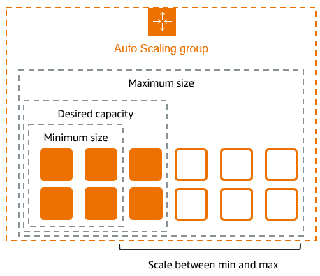
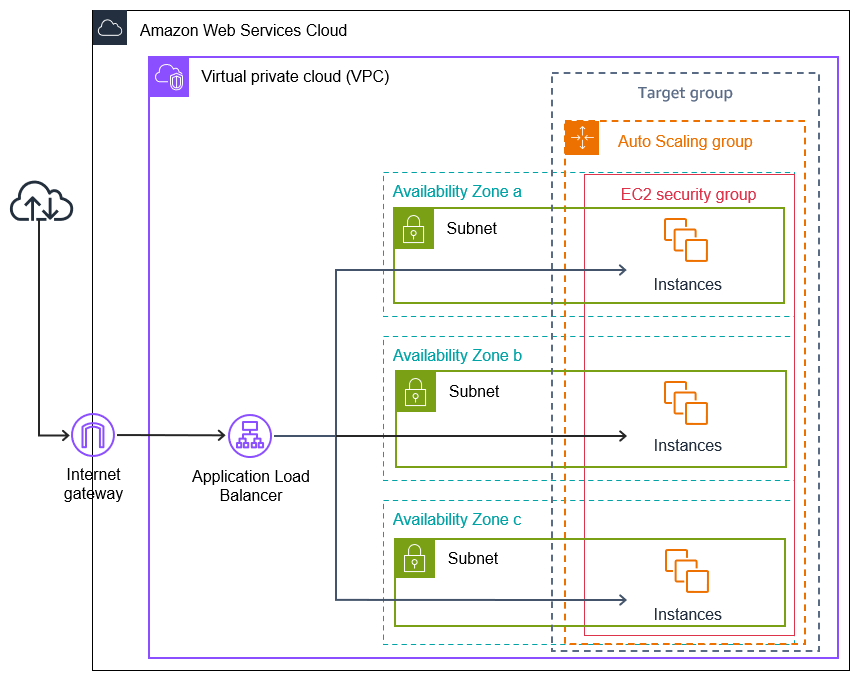

# What is Amazon EC2 Auto Scaling?

Amazon EC2 Auto Scaling helps you ensure that you have the correct number of Amazon EC2 instances available to handle the load for your application.

You create collections of EC2 instances, called `Auto Scaling groups`.

If you specify `scaling policies`, then Amazon EC2 Auto Scaling can launch or terminate instances as demand on your application increases or decreases.

> Number of instances

1. Min quota: You can specify the minimum number of instances in each Auto Scaling group, and Amazon EC2 Auto Scaling ensures that your group never goes below this size.
2. Max quota: You can specify the maximum number of instances in each Auto Scaling group, and Amazon EC2 Auto Scaling ensures that your group never goes above this size.
3. Desired quota: If you specify the desired capacity, either when you create the group or at any time thereafter, Amazon EC2 Auto Scaling ensures that your group has this many instances.

> In above image, the following Auto Scaling group has a minimum size of four instances, a desired capacity of six instances, and a maximum size of twelve instances. The scaling policies that you define adjust the number of instances, within your minimum and maximum number of instances, based on the criteria that you specify.

# Tutorial: Create your first Auto Scaling group

To get started using Amazon EC2 Auto Scaling, you can use the default VPC for your AWS account. The default VPC includes a default public subnet in each Availability Zone and an internet gateway that is attached to your VPC. 

### Prepare for the walkthrough
- Step 1: Create a launch template
- Step 2: Create a single-instance Auto Scaling group
- Step 3: Verify your Auto Scaling group
- Step 4: Terminate an instance in your Auto Scaling group
- Step 5: Next steps
- Step 6: Clean up

# Set up a scaled and load-balanced application

Registering your Auto Scaling group with an Elastic Load Balancing load balancer helps you set up a load-balanced application. Elastic Load Balancing works with Amazon EC2 Auto Scaling to distribute incoming traffic across your healthy Amazon EC2 instances. 

## Lab: Perform

